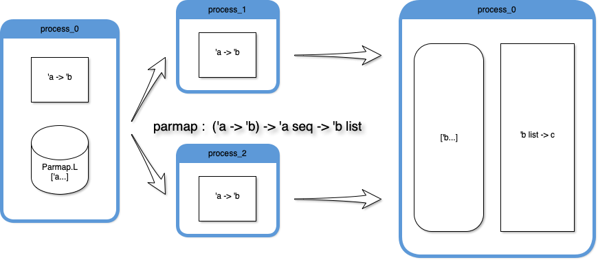
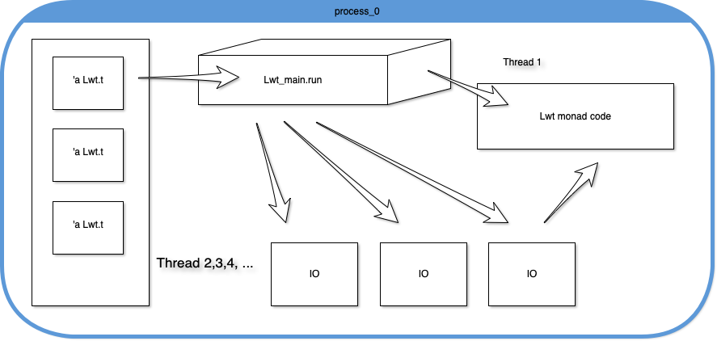
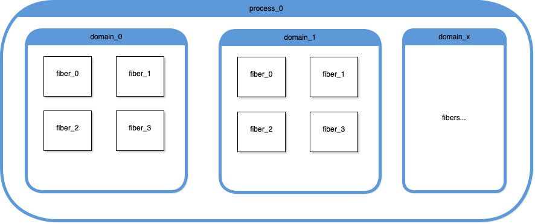
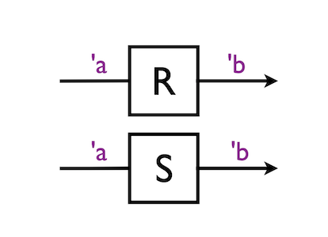
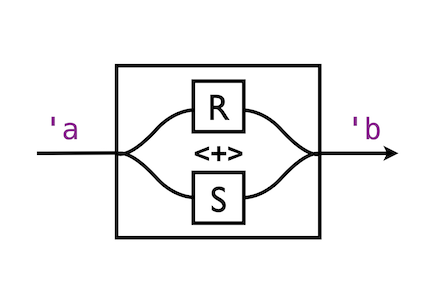
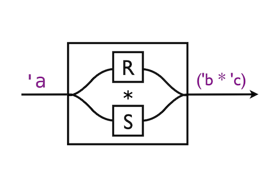

title: Multicore OCaml
subtitle: Прекрасный OCaml будущего
class: animation-fade
layout: true

<!-- This slide will serve as the base layout for all your slides -->
.bottom-bar[
  {{title}}
]

---

class: impact

# {{title}}
## {{subtitle}}
### @argent_smith
### Evrone.com
### FPure

---

### ~$ wtf OCaml

.col-4[
* FP (multiparadigmal)
* Strict
* ML
* DOCS
* Quick start
* FAST code
* Native 4 all
* YEARS in production
* Toolz rule
]
.col-8[
``` ocaml
let reader file_num =
  let name = Printf.sprintf "files/%d.dat" file_num in
  let descr = Unix.openfile name [O_RDONLY] 0o640 in
  let stream = Unix.in_channel_of_descr descr
               |> Stream.of_channel
  in
  let rec read_char stream n =
    match Stream.peek stream with
    | None -> n
    | _    ->
       Stream.junk stream;
       read_char stream (n + 1)
  in
  let nchars = read_char stream 0 in
  Unix.close descr;
  (name, nchars)

```
]

---

### OCaml parallelism at hand

Ye olde fork()

``` ocaml
module Unix = sig

  (* ... *)

  val fork : unit -> int

  (* ... *)

end

(* use *)

match fork () with
| 0   -> child_code ()
| pid -> parent_code pid

```

---

### OCaml parallelism at hand

`~$ opam install parmap`

.center[]

---

### OCaml parallelism at hand

``` ocaml
let num_files = 10

let reader file_num =
  let name = Printf.sprintf "files/%d.dat" file_num in
  let descr = Unix.openfile name [O_RDONLY] 0o640 in
  let stream = Unix.in_channel_of_descr descr
               |> Stream.of_channel
  in
  let rec read_char stream n =
    match Stream.peek stream with
    | None -> n
    | _    ->
       Stream.junk stream;
       read_char stream (n + 1)
  in
  let nchars = read_char stream 0 in
  Unix.close descr;
  (name, nchars)

let run_readers_for num =
  Printf.printf "Starting %d workers\n" num;
  let ids = List.init num (fun i -> i + 1) in
  let results = Parmap.parmap ~ncores:num_files reader (Parmap.L ids) in
  List.iter (fun (name, n) -> Printf.printf "%s\t=> %d chars\n" name n) results

let () =
  run_readers_for num_files
```

---

### OCaml concurrency at hand

Monadic concurrency libs:

* `Async` by Janestreet
* `Lwt` by Ocsigen

---

### OCaml concurrency at hand

`~$ opam install lwt`

.center[]

---

### OCaml concurrency at hand

``` ocaml
let num_files = 10

let reader file_num =
  let name = Printf.sprintf "files/%d.dat" file_num in
  let stream = Lwt_io.chars_of_file name in
  let rec read_char stream n =
    match%lwt Lwt_stream.get stream with
    | None -> Lwt.return (name, n)
    | _    -> read_char stream (n + 1)
  in
  read_char stream 0

let collect_results =
  let rec append_to_ready ready pending =
    let%lwt (ready', pending') = pending in
    let ready'' = List.append ready ready' in
    match List.length pending' with
    | 0 -> Lwt.return ready''
    | _ -> Lwt.nchoose_split pending'
           |> append_to_ready ready''
  in
  append_to_ready []
```

---

### OCaml concurrency at hand

``` ocaml
let run_readers_for num =
  let%lwt () = Lwt_io.printlf "Starting %d workers" num in
  List.init num (fun i -> i + 1)
  |> List.map reader
  |> Lwt.nchoose_split
  |> collect_results

let () =
  run_readers_for num_files
  |> Lwt_main.run
  |> List.iter (fun (name, nchars) -> Printf.printf "%s\t=> %d chars\n" name nchars)
```

---

### OCaml threads???

<blockquote>
The threads library is implemented by time-sharing on a
single processor. It will not take advantage of multi-processor
machines. Using this library will therefore never make programs run
faster. However, many programs are easier to write when structured as
several communicating processes.
</blockquote>
.right[Manual, The]

<blockquote>
Currently, threading is supported in OCaml via the global
interpreter lock (GIL), but this prohibits multiple threads running
OCaml code at any one time.
</blockquote>
.right[Ocamllabs.io]

---

### ~$ whois Multicore OCaml

.big[OCaml Labs] // [ocamllabs.io](http://ocamllabs.io) // U. of Cambridge & Jane Street

--

.big[KC Sivaramakrishnan], PhD // @kayceesrk // IIT Madras

---

### ~$ whatis Multicore OCaml

--

* Runtime

  * Memory model
  * Domains & fibers
  * GC

--

* Language

  * Algebraic effects (& handlers)
  * Utility libs (e.g. Reagents)

--

* IRL code

  * (\* WIP \*)

---

### Memory model

All about `ref`s

``` ocaml
1. let r = ref 0 in
2. let a = !r in
3. r := 1
4. let b = !r in
5. let c = !r in
    ...
```

---

### Memory model

Atomics

.col-6[
thread 1:
``` ocaml
1. message := 42
2. flag := true

```

thread 2:
``` ocaml
3. let seen = !flag in
4. let value = !message in
5. if seen then print_int value;
```
]

--

.col-6[
thread 1:
``` ocaml
1. message := 42
2. Atomic.set flag true
```

thread 2:
``` ocaml
3. let seen = Atomic.get flag in
4. let value = !message in
5. if seen then print_int value;
```
]

---

### Memory model

Atomic CAS (thanks KC)

``` ocaml
module CAS : sig
  val cas : 'a ref -> expect:'a -> update:'a -> bool
end = struct

(* atomically... *)
let cas r ~expect ~update =
  if !r = expect then
  (r:= update; true)
  else false
end
```

---

### Domains, fibers and GC

* .em[Fibers:] concurrency // "green threads"
* .em[Domains:] parallelism // maps to k. threads / CPU cores

.center[]

---

### Domains, fibers and GC

GC:

 1. Generational (fibers/mutations, etc)
 2. Independent minor GC
 3. Mostly concurrent M&S major GC
 4. Chalenges: performance & safety

Read: ["A deep dive into Multicore OCaml garbage collector"](http://kcsrk.info/multicore/gc/2017/07/06/multicore-ocaml-gc/) by KC

---

### Algebraic Effects

.col-6[
``` ocaml
type 'a _promise =
  Waiting of ('a,unit) continuation list
| Done of 'a

type 'a promise = 'a _promise ref

effect Async : (unit -> 'a) -> 'a promise
let async f = perform (Async f)

effect Yield : unit
let yield () = perform Yield

effect Await : 'a promise -> 'a
let await p = perform (Await p)

```
]
.col-6[
```ocaml
let run main =
  let rec fork : 'a. 'a promise -> (unit -> 'a) -> unit =
    fun pr main ->
      match main () with
      | v -> failwith "Value case not implemented"
      | effect (Async f) k ->
          failwith "Async not implemented"
      | effect Yield k ->
          enqueue (continue k);
          dequeue ()
      | effect (Await p) k ->
          begin match !p with
          | Done v -> continue k v
          | Waiting l -> failwith "Await.Waiting not implemented"
          end
  in
  fork (ref (Waiting [])) main

```
]

---

### Algebraic Effects

Continuations:

  * => Fibers
  * Linear (one-shot) / 'Linear types' via exceptions
  * Heap-allocated stacks
  * Modular vs monadic code
  * `ocamllabs/ocaml-effects-tutorial`

---

### Reagents

--

* ... are from Scala

  Aaron Turon et al., 2012

--

* ... are for Comms

  esp. lock-free comms

--

* ... are Atomic

  with shared memory

--

* ... are Functions

  composable

---

### Reagents

Dining Philosophers

.col-6[
``` ocaml
let (num_philosophers, num_rounds) = ...

...

module S = Sched_ws.Make (
  struct
    let num_domains = num_philosophers
    let is_affine = true
  end
)

module Reagents = Reagents.Make (S)
open Reagents
open Channel

...

type fork =
  {drop : (unit,unit) endpoint;
   take : (unit,unit) endpoint}

```
]
.col-6[
``` ocaml
let drop f = swap f.drop
let take f = swap f.take

let eat l_fork r_fork =
  ignore @@ run (take l_fork <*> take r_fork) ();
  S.fork @@ run (drop l_fork);
  S.fork @@ run (drop r_fork)
```
]

---

.col-6[
### Reagents

Combinators


]




---

### History

* Jan 2014: Initiated by Stephen Dolan and Leo White
* Jan 2015: KC joins the project at OCaml Labs
* Sep 2015: Effect handlers @ OCaml workshop
* Jan 2016: Native code backend for Amd64 on Linux and OSX
* Jun 2016: Multicore rebased to 4.02.2 from 4.00.0
* Sep 2016: Reagents library, Multicore backend for Links @ OCaml workshop
* Apr 2017: ARM64 backend
* Sep 2017: Memory model proposal @ OCaml workshop
* Sep 2017: CPS translation for handlers @ FSCD
* Apr 2018: Multicore rebased to 4.06.1 (will track releases going forward)
* Jun 2018: Memory model @ PLDI

---

### Plans

* Q3’18 — Q4’18: Implement missing features, upstream prerequisites to trunk
* Q1’19 — Q2’19: Submit feature-based PRs to upstream

ALSO

* Avoid become C++
* MC programs verification
* Multicore MirageOS
* Libs & ports
* Lwt (!?)

---

### Sources

* ocaml.org
* ocamllabs.io
* gh -> ocaml-multicore
* .big[kcsrk.info] | gh -> @kayceesrk | twi -> @kc_srk
* gh -> kayceesrk/effects-examples
* gh -> ocamllabs/ocaml-effects-tutorial
* reddit -> r/ocaml
* discord -> ocaml
* irc -> freenode #ocaml

---

### THNX

.center.primary[
.huge[gh -> @argent-smith]

.big[
twi -> @argent_smith

evrone.com

{Tver.io}
]
]
